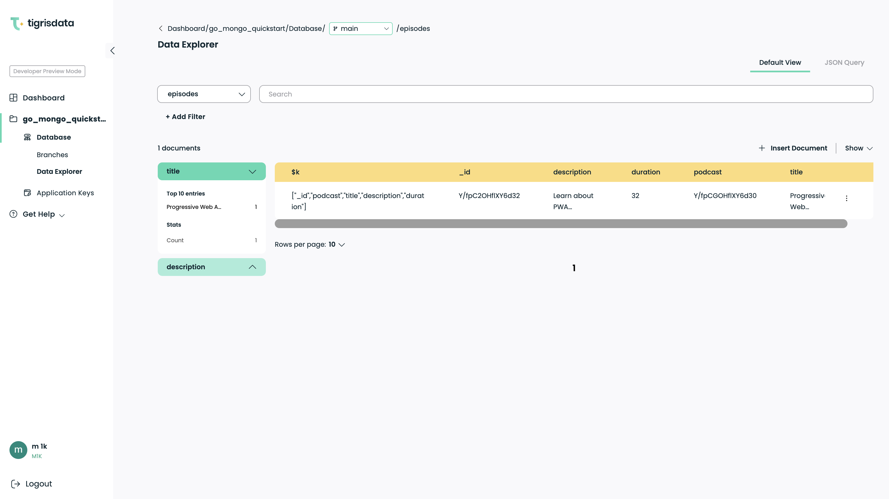

# Quickstart: Connect a Go application to Tigris using the Go driver for MongoDB

Tigris is the open source MongoDB Atlas alternative.

This quickstart is a simple application that uses the [Go driver for MongoDB](https://github.com/mongodb/mongo-go-driver)
through FerretDB in a way that is transparent to the application that the
data is stored in Tigris Cloud database.

## Prerequisites

- A Tigris Cloud account. [Create one for free](https://console.preview.tigrisdata.cloud/signup).
- [Go](https://golang.org/) installed on your computer, and a working
  knowledge of Go.
- [Git](https://git-scm.com/downloads).
- Tigris CLI. The installation instructions can be found [here](https://www.tigrisdata.com/docs/sdkstools/cli/installation/).

## Setup

Clone the repo

```shell
git clone https://github.com/tigrisdata-community/go-mongo-quickstart.git
```

Change into the directory where you cloned the repo

```shell
cd go-mongo-quickstart
```

### Create the Tigris project and generate the application key

Login to Tigris Cloud

```shell
tigris login
```

Create a Tigris project and generate the application key. The project name
will be used as the MongoDB database name. The application key is used to
authenticate to Tigris.

```shell
tigris create project go_mongo_quickstart
tigris create app_key default --project go_mongo_quickstart
```

The above command will have an output similar to the following

```json
{
  "id": "your_client_id",
  "name": "default",
  "secret": "your_client_secret",
  "created_at": 1676857746000,
  "created_by": "google-oauth2|1111xxx",
  "project": "go_mongo_quickstart"
}
```

### Setup the `.env` file

This application uses environment variables to store the URI, application
key and project name. Using the `id`, `secret` and `project` values from the
output above, create a file named `.env` with the following content

```shell
TIGRIS_URI=m1k.preview.tigrisdata.cloud
TIGRIS_PROJECT=go_mongo_quickstart
TIGRIS_CLIENT_ID=your_client_id
TIGRIS_CLIENT_SECRET=your_client_secret
```

## Running the quickstart

Run this quickstart application using the following command

```shell
go run main.go
```

You should see output similar to the following

```text
Connected.
Inserted document into podcast collection: ObjectID("63f7e90863877e55d8e9ddf4")
Inserted 2 documents into episode collection!
Found 1 documents matching filter!
[
    {
        "ID": "63f7e90b63877e55d8e9ddf6",
        "Podcast": "63f7e90863877e55d8e9ddf4",
        "Title": "Progressive Web Application Development",
        "Description": "Learn about PWA development with Tara Manicsic.",
        "Duration": 32
    }
]
Updated 1 Documents!
DeleteOne removed 1 document(s)
```

## Explore the data

You can explore the data created by the quickstart application in
[Tigris Cloud Console](https://console.preview.tigrisdata.cloud/)


